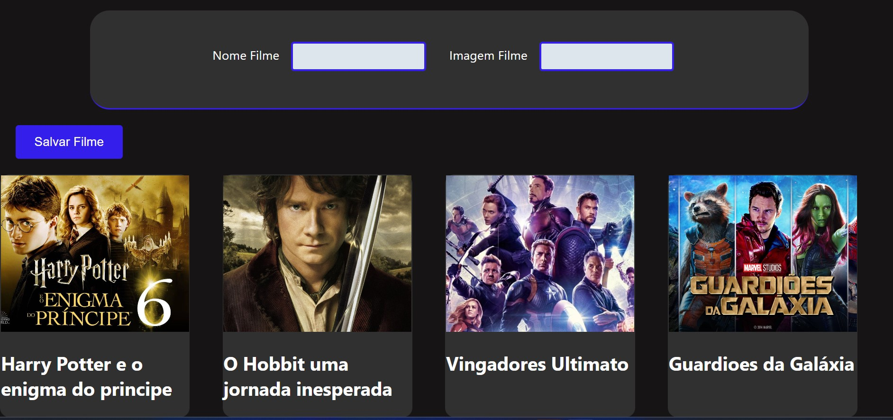

# CTD

> FrontEnd 3 CheckPoint_1

Projeto de catalago de filmes preferidos desenvolvido para o checkpoint 1 de FrontEd 3.

[🔗 Clique aqui para acessar](https://joeljerrysdev.github.io/CatalogoFilmesReactJS/)

## 🛠 Tecnologias

 
  
  
  
   
  

  

## 💛 Contato

joeljerrys95@gmail.com
